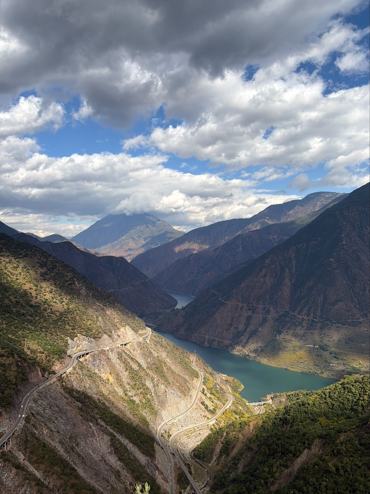

# PhotoEditKit

[](#swift-package-manager)
[](#requirements)
[](#privacy)

**One call gives a photo the edit it needs, entirely on the device.**

PhotoEditKit is a photo editing toolkit for iOS apps. It looks at a photo
(exposure, colour cast, faces, subject, grain, scene) and suggests edits you
can show as a picker or apply straight away. It also includes the Core Image
pipeline that renders them and an editor model for building your own editing
screen.

| Original | AI edit |
| :---: | :---: |
|  |  |
|  |  |

[More examples](#examples)

```swift
if let config = AIPostProcessingHelper.topSuggestion(for: photo, metadata: properties) {
    let edited = CIImage(cgImage: photo).applyingEditConfig(config)
}
```

## Features

- **AI edit suggestions.** Up to ten ranked looks per photo, each with a
  title and a thumbnail, or a single best edit. A photo that's already good
  gets `nil` rather than a style it didn't ask for.
- **Corrections and styles.** Brighten, Lift Shadows, Recover Highlights,
  Warm Up, Cool Down, Clean Up and more fix problems. Vivid, Punch, Matte,
  Muted, Soft and others are styles, sized to each photo. [See every recipe](#the-recipes).
- **Natural faces.** Every look keeps skin hue and saturation natural.
- **RAW aware.** Can match the camera's own rendering of a RAW and build the
  other looks on top of it.
- **A full editor model.** `EditController` handles loading, live previews,
  undo/redo, crop, rotation, portrait blur and full-resolution export. You
  build the UI.
- **HDR kept.** Exports keep the iPhone's HDR gain map.
- **Style matching.** Makes one photo's tones match a reference photo.
- **Private by design.** No network requests, no models to download, no
  account. Safe to use in app extensions.
- **Localized** in English and Simplified Chinese.

## Contents

- [Examples](#examples)
- [Requirements](#requirements)
- [Installation](#installation)
- [Quick start: let the AI edit a photo](#quick-start-let-the-ai-edit-a-photo)
- [Edits: `EditConfig`](#edits-editconfig)
- [Rendering an edit](#rendering-an-edit)
- [AI suggestions](#ai-suggestions)
- [The recipes](#the-recipes)
- [Building an editor with `EditController`](#building-an-editor-with-editcontroller)
- [Exporting with HDR](#exporting-with-hdr)
- [Matching a style](#matching-a-style)
- [Threading](#threading)
- [Localization](#localization)
- [Privacy](#privacy)
- [Support](#support)

## Examples

Each photo on the left, and on the right the edit the AI suggested for it.

| Original | AI edit |
| :---: | :---: |
|  |  |
|  |  |

## Requirements

- iOS 17.6 or later
- Xcode with the Swift compiler this release was built with, or a newer one.
  The framework ships a module interface, so a newer compiler can read it; an
  older one can't.

## Installation

PhotoEditKit ships as a binary `PhotoEditKit.xcframework`.

### Swift Package Manager

In Xcode, choose **File → Add Package Dependencies…**, enter

```
https://github.com/8kdesign/PhotoEditKit
```

and add the **PhotoEditKit** library to your app target.

To declare the dependency in your own `Package.swift`:

```swift
.package(url: "https://github.com/8kdesign/PhotoEditKit", from: "1.0.0")
```

### Manual

1. Download `PhotoEditKit.xcframework.zip` from the
   [latest release](https://github.com/8kdesign/PhotoEditKit/releases/latest),
   unzip it and copy `PhotoEditKit.xcframework` into your project folder.
2. In your app target, go to **General → Frameworks, Libraries, and Embedded
   Content**, click **+**, then **Add Other… → Add Files…** and pick the
   `.xcframework`.
3. Set it to **Embed & Sign**. For an app extension that also uses it, add it
   to the extension as **Do Not Embed**; the app embeds it.

If the app crashes at launch with `Library not loaded: @rpath/PhotoEditKit.framework`,
the framework isn't embedded. Check step 3.

## Quick start: let the AI edit a photo

```swift
import ImageIO
import PhotoEditKit

guard let source = CGImageSourceCreateWithURL(photoURL as CFURL, nil) else { return }
let properties = CGImageSourceCopyPropertiesAtIndex(source, 0, nil) as? [String: Any]

// A small upright copy is all the AI needs, and much faster than full size.
let options = [
    kCGImageSourceCreateThumbnailFromImageAlways: true,
    kCGImageSourceCreateThumbnailWithTransform: true,
    kCGImageSourceThumbnailMaxPixelSize: 512,
] as CFDictionary
guard let small = CGImageSourceCreateThumbnailAtIndex(source, 0, options) else { return }

// Off the main thread: this measures the photo.
if let config = AIPostProcessingHelper.topSuggestion(for: small, metadata: properties),
   let original = CIImage(contentsOf: photoURL, options: [.applyOrientationProperty: true]) {
    let edited: CIImage = original.applyingEditConfig(config)
} else {
    // The photo is already good. Keep it as it is.
}
```

`metadata` is the photo's ImageIO properties
(`CGImageSourceCopyPropertiesAtIndex`). It's optional, but pass it when you
have it: the exposure values in it are how the AI tells a photo that is dark
on purpose (a night street, a lamp-lit room) from one that came out too dark.
Without them, more night photos get brightened.

## Edits: `EditConfig`

An `EditConfig` describes one complete edit: slider values, crop and rotation.
The AI produces them, the editor keeps a history of them, and the pipeline
renders them.

```swift
let config = EditConfig(properties: [
    .exposure: 0.2,
    .contrast: 0.1,
    .saturation: -0.3,
    .vignette: 0.4,
])
```

Each value is an **offset from neutral**, so `0` (or leaving the key out)
means "unchanged", whatever the underlying filter treats as neutral. To scale
an edit up or down, multiply its values. Leave `.aspectratio` and `.rotation`
alone when you do, because half a crop isn't a gentler crop:

```swift
var properties = config.properties
for (key, value) in properties where key != .aspectratio && key != .rotation {
    properties[key] = value * 0.5
}
let gentler = EditConfig(properties: properties, crop: config.crop, editRotation: config.editRotation)
```

### Settings and ranges

| `EditSettingType` | Range | |
|---|---|---|
| `.exposure` | −0.5 … 0.5 | |
| `.brightness` | −0.5 … 0.5 | |
| `.contrast` | −0.5 … 0.5 | |
| `.shadow` | −1 … 1 | positive lifts shadows |
| `.highlight` | −1 … 0 | negative recovers highlights |
| `.saturation` | −1 … 1 | |
| `.temperature` | −1 … 1 | positive is warmer |
| `.shadowWarmth` | −1 … 1 | warms or cools the shadows only |
| `.sharpness` | 0 … 2 | |
| `.noiseReduction` | 0 … 1 | |
| `.vignette` | −1 … 1 | |
| `.boostRed` `.boostYellow` `.boostGreen` `.boostCyan` `.boostBlue` `.boostMagenta` | −1 … 1 | per-colour saturation |
| `.rotation` | −45 … 45 | degrees, straightening |
| `.depth` | 0 … 40 | background blur; needs depth data |

`type.getSetting()` returns an `EditSetting` with the localized name, an SF
Symbol and the range (`minValue`, `maxValue`), which is everything you need to
build a slider.

Read a value with `config.value(of: .saturation)` (0 when untouched), and make
a change with `setting.getEditConfig(amount)`, which is ready for
`previewConfig` and `addConfig`. A change made this way carries its setting, so
consecutive changes to one slider merge into a single undo step:

```swift
let saturation = EditSettingType.saturation.getSetting()
let current = editor.currentConfig.value(of: .saturation)       // e.g. 0.2
editor.addConfig(saturation.getEditConfig(0.1))                  // now 0.3
```

`availableEditSettings`, `colorBoostSettings` and `rotationSettings` list the
settings in display order.

Crop is `config.crop`, a rect in normalized coordinates, where `(0, 0, 1, 1)` is
the whole image. Quarter turns and flips are `config.editRotation` (`EditRotation`).

`EditConfig` is immutable. `[config1, config2].combine()` merges configs by
adding their values, the same way the editor stacks changes.

## Rendering an edit

**Core Image.** Applies the colour and tone settings, and the vignette, but
not crop or rotation:

```swift
let output: CIImage = input.applyingEditConfig(config)
```

When you're rendering a preview that is smaller than the photo, pass
`renderScale` (preview size ÷ full size). Sharpening and noise reduction work
in pixels, so without it a small preview looks sharper and grainier than the
export.

**Full render, including crop and rotation.** Use `PostProcessingHelper`. Turn
the vignette off in the first step and apply it last, so it is centred on the
cropped photo rather than the original frame:

```swift
// On LogicActor
let helper = PostProcessingHelper(image: cgImage)
helper.applyEditConfig(config: config, includeVignette: false)
helper.applyRotationCropConfig(config: config)
helper.applyFullRotateAndFlip(editRotation: config.editRotation)
helper.applyVignette(config: config)
let result: CGImage? = helper.toCGImage()
```

`PostProcessingHelper.renderedEdit(of:config:rawRecovery:)` is a shortcut for the
colour and tone part alone.

## AI suggestions

All AI is reached through `AIPostProcessingHelper`. The calls are synchronous
and take a noticeable amount of time on full-resolution photos, so run them off
the main thread (for example inside `Task.detached { … }`).

### One edit

```swift
AIPostProcessingHelper.topSuggestion(for: cgImage, metadata: properties) -> EditConfig?
```

Returns the edit the photo most needs, or `nil` when it doesn't need one. It
never crops or rotates. A copy of about 512 px on the long edge is enough, and
much faster than full resolution. A `CGImage` carries no orientation, so turn
it upright first.

This is not the same as the first of `suggestions(for:)`:

- If the look that ranks first would barely change the photo, `topSuggestion`
  returns `nil` rather than the next look down. A good photo stays as it is
  instead of getting a style it didn't ask for.
- It doesn't measure grain, since a small copy hides it. Its edit never adds
  noise reduction on that account. Use `suggestions(for:)` on the full-size
  photo when grain matters.

### A list of suggestions

```swift
let suggestions: [EditSuggestion] = AIPostProcessingHelper.suggestions(for: uiImage, metadata: properties)
for suggestion in suggestions {
    suggestion.title      // LocalizedStringResource, e.g. "Brighten"
    suggestion.config     // EditConfig to apply
    suggestion.thumbnail  // small rendered preview, ready for a picker
}
```

Returns up to ten suggestions, best first. Pass the photo at full resolution,
which is what the grain measurement needs; its `imageOrientation` is honoured.
It took about 0.2 s on a 12 MP photo in the simulator; budget more on older
devices. If the calling `Task` is
cancelled, it stops at the next stage and returns an empty array.

If you develop RAW files yourself, pass the camera's embedded preview. The
AI then offers an **Original** suggestion that matches the camera's own
rendering, and builds every other suggestion on top of it:

```swift
let raw = AIPostProcessingHelper.RawContext(cameraReference: embeddedPreview, rawRecovery: nil)
AIPostProcessingHelper.suggestions(for: develop, raw: raw, metadata: properties)
```

### Scene

```swift
let scene: AIScene? = AIPostProcessingHelper.classifyScene(cgImage)
scene?.title   // localized name
scene?.icon    // SF Symbol name
```

The scenes are `people`, `animals`, `food`, `object`, `indoor`, `city`, `sky`,
`nature` and `light`. It returns `nil` when the photo couldn't be classified.

## The recipes

Each suggestion comes from one of a fixed set of recipes. The AI uses only
the recipes that suit the photo, sizes each one to it, and puts the one the
photo most needs first. The same recipe can come out differently on two photos: Vivid on a
landscape leans into its greens, Vivid on a street at night into its lights.

There are two kinds. **Corrections** fix something about the photo: its
exposure, its colour or its noise. **Styles** are a matter of taste. When a
photo needs fixing, corrections come first.

### Corrections

| Recipe | What it does |
|---|---|
| Original | RAW photos only. Matches the camera's own rendering of the RAW, which is usually livelier than a plain develop. Every other recipe on a RAW starts from it. |
| Clean Up | Reduces grain and noise, and leaves tone and colour alone. |
| Balance Light | RAW photos only. Opens up the shadows and brings back the highlights together, for backlit or high-contrast scenes. |
| Brighten | Lifts a photo that came out too dark. |
| Deepen | The opposite of Brighten: richer blacks and more contrast for a photo that looks grey or washed out, without lightening it. |
| Recover Highlights | Brings back detail in bright areas such as a sky. Ranks lower when what's blown out is away from the subject, such as a white border or a lit window, since a JPEG has no detail left there to bring back. A RAW that still holds the detail keeps its place. |
| Lift Shadows | Opens up dark areas without brightening the rest of the photo, including a subject that's dark against a bright sky or window. |
| Warm Up | Takes a blue or cold colour cast back to neutral. |
| Cool Down | Takes an orange or yellow colour cast back to neutral. |
| True Color | For daylight photos where people and buildings in shade have turned blue and milky under a bright sky. Warms the shade and restores its contrast. |

Warm Up and Cool Down correct a cast; they don't add one. A photo with
balanced colour gets neither.

### Styles

| Recipe | What it does |
|---|---|
| Crisp | Sharper detail with a little more contrast. |
| Punch | Stronger contrast and clarity, with a moderate colour boost. Keeps the photo's warmth: it doesn't warm or cool it. |
| Pop | Brighter and punchier at once, for a light-coloured subject in a dim room, such as a glass of juice under a lamp. Not offered on photos with a lot of white. |
| Vivid | Richer, more saturated colour, led by the colours the photo is about. |
| Muted | Quieter colour overall, while the main subject keeps its own. Takes out more colour the more colourful the photo is. |
| Matte | A faded, film-print style: softened blacks, gentler colour and a light vignette. Fades more on a contrasty photo, less on a flat one. |
| Soft | A gentle, warm finish with low contrast. |
| Spotlight | Darkens the edges to draw the eye to the middle of the photo. Leaves colour alone. |

### Every recipe

- **Faces:** every recipe, corrections included, is adjusted so skin keeps a
  natural hue and saturation, and a soft face is sharpened slightly (except in
  Clean Up and Soft). Faces smaller than about 2% of the frame count for less.
- **Subject and focus:** the AI works out where the subject is from faces,
  where the eye is drawn and what's in focus. Brighten judges exposure partly
  by the subject. On a photo with a shallow depth of field, Brighten, Lift
  Shadows and Recover Highlights judge mostly by the part in focus, so a
  blurred dark background or blown-out bokeh counts for little.
- **Grain:** a recipe that would make grain more visible, such as a shadow
  lift, adds noise reduction for it. A lift that the grain would make too
  costly is cut back, or the recipe is dropped.
- **Small edits are skipped:** a recipe that would barely change the photo isn't
  offered, so a good photo can get only a few suggestions.
- **Similar looks are spread out:** when two suggestions would look nearly
  the same, the second moves down the list.

## Building an editor with `EditController`

`EditController` is an `ObservableObject` that runs a complete editing
session: it loads the photo, renders previews as edits change, keeps
undo/redo, runs the AI suggestions and renders the final export. You provide
the photo through an `EditSource` and build whatever UI you like on top.

### 1. Provide the photo

`EditController` doesn't know about the photo library or files. It reads
everything through your `EditSource`. An ordinary photo needs only three
methods; the RAW and depth ones have defaults.

```swift
// `nonisolated` because the editor calls the source from its own actor, not
// the main actor that new Xcode projects give every type by default.
// `@unchecked Sendable` because the source is shared with that actor: it's
// safe here since nothing changes after `init`.
nonisolated final class FileEditSource: EditSource, @unchecked Sendable {
    let data: Data
    let imageSource: CGImageSource

    init?(data: Data) {
        guard let source = CGImageSourceCreateWithData(data as CFData, nil) else { return nil }
        self.data = data
        self.imageSource = source
    }

    // The full-resolution photo. A UIImage's imageOrientation is honoured, so
    // you don't need to redraw a photo that carries an EXIF orientation.
    @LogicActor func loadOriginal() async -> EditSourceImage? {
        UIImage(data: data).map { EditSourceImage(image: $0, isDevelopedRaw: false) }
    }

    // The ImageIO properties. The AI reads exposure information from them.
    func loadMetadata() async -> [String: Any]? {
        CGImageSourceCopyPropertiesAtIndex(imageSource, 0, nil) as? [String: Any]
    }

    // The encoded file, so an export can keep its HDR gain map.
    func loadFileData() async -> (data: Data, orientation: CGImagePropertyOrientation)? {
        (data, orientation)
    }

    private var orientation: CGImagePropertyOrientation {
        let properties = CGImageSourceCopyPropertiesAtIndex(imageSource, 0, nil) as? [String: Any]
        let value = properties?[kCGImagePropertyOrientation as String] as? UInt32
        return value.flatMap(CGImagePropertyOrientation.init(rawValue:)) ?? .up
    }
}
```

For a RAW, implement `isRaw`, `loadRawExtras` and `developRaw`; for depth
(portrait blur), `loadDepth` and `defaultBlurRadius`. `loadPreview(maxDimension:)`
is optional too: implement it if you can make a small copy more cheaply than
shrinking the original, for example if you already have one on screen.

#### Actor isolation

The editor calls your source from its own actors, so the source mustn't be
tied to the main actor:

- In a project with **Default Actor Isolation** set to **MainActor** (the
  default for new Xcode projects), mark the class `nonisolated` as above.
  Without it, Swift 5 mode warns and Swift 6 mode refuses to compile.
- The source is handed to the editor's actor, so it has to be `Sendable`. A
  class that doesn't change after `init` can declare `@unchecked Sendable`;
  one that does needs a lock around what changes.

### 2. Run the session

```swift
// On the main actor, e.g. in your view model
let editor = EditController()

// Show `editor.editedImage` (a preview-sized UIImage) in your UI. It's set by
// the time `prepare` returns, and updates after every edit.
// Observe `editor.aiProcessingState` for suggestions.

editor.processAI()                        // ask for suggestions; runs once the photo has loaded
Task { await editor.prepare(source: source) }
```

`aiProcessingState` moves from `.pending` to `.loading` to
`.done(result: [EditSuggestion])`, or to `.unavailable` when there are no
suggestions to offer.

### 3. Edit

The configs you pass to `previewConfig` and `addConfig` are **changes**, added
on top of the edit so far. `addConfig(EditConfig(properties: [.exposure: 0.1]))`
twice gives an exposure of 0.2.

| Call | |
|---|---|
| `applySuggestion(_:)` | apply an AI suggestion; `nil` removes it. `appliedSuggestionID` tells you which one is on. See below for how it treats earlier edits |
| `previewConfig(_:)` | show a change while a slider is moving, without adding it to the history. Each call replaces the previous preview |
| `confirmPreviewConfig()` | commit the previewed change when the slider is released |
| `addConfig(_:)` | commit a change in one step |
| `undoConfig()` / `redoConfig()` | with `canUndo()` / `canRedo()`; see below for keeping buttons up to date |
| `historyCount` | how many steps undo can go back. To stop undo at a point (e.g. right after a suggestion was applied), read it there and allow undo only while it's larger |
| `hasEdits()` | whether anything has been changed |
| `showOriginalImage` | a flag for your UI, e.g. while a "compare" button is held. The controller doesn't swap images itself: show `sourcePreviewImage` while it's `true` |
| `currentConfig` | the edit as it stands |
| `aspectRatio`, `editRotation` | crop ratio and quarter turns |

#### Suggestions replace earlier slider work

Applying a suggestion sets every colour and tone setting to the suggestion's
own value, so slider changes made *before* it are replaced rather than added
to. A second suggestion replaces the first. Crop, rotation and background blur
are kept. It all goes on the history as one step: a single undo brings back
the edit as it was, and applying a suggestion clears redo.

Slider changes made *after* a suggestion are separate steps on top of it.

#### Keeping undo and redo buttons up to date

Every edit, undo and redo fires the controller's `objectWillChange`. A SwiftUI
view that observes the controller re-reads `canUndo()` and `canRedo()`
automatically:

```swift
@ObservedObject var editor: EditController

Button("Undo") { editor.undoConfig() }.disabled(!editor.canUndo())
```

In UIKit, subscribe to `objectWillChange` and read the values on the next turn
of the main run loop. `objectWillChange` fires just before the change, so
reading them inside the sink gives the old values:

```swift
cancellable = editor.objectWillChange
    .receive(on: RunLoop.main)
    .sink { [weak self] in
        guard let self else { return }
        undoButton.isEnabled = editor.canUndo()
        redoButton.isEnabled = editor.canRedo()
    }
```

### 4. Export and finish

```swift
let config = editor.currentConfig
let rotation = editor.editRotation
if let rendered = await editor.renderForExport(config: config, editRotation: rotation) {
    rendered.image     // full-resolution CGImage
    rendered.gainMap   // HDR gain map, when the original had one
}
editor.destroy()       // when the editing session ends
```

## Exporting with HDR

Photos taken on recent iPhones carry an HDR gain map. To keep it in an export,
encode the image and the gain map together:

```swift
let data = HDRGainMap.encode(rendered.image, gainMap: rendered.gainMap, type: .heic, quality: 0.9)
```

When there's no gain map, or attaching it fails, the image is encoded on its
own, so you get a file either way.

If you then copy the data into a `CGImageDestination` to add metadata, call
`HDRGainMap.copy(from:to:)` as well, because ImageIO leaves the gain map behind
when it copies an image. `HDRGainMap.read(from:orientation:)` and
`hasGainMap(_:)` read and detect gain maps.

## Matching a style

`StyleMatcher` makes one photo's tones match a reference photo, or the average
of several:

```swift
// On LogicActor
guard let reference = StyleMatcher.statistics(for: referenceImage),
      let target = StyleMatcher.statistics(for: photo),
      let transform = StyleMatcher.transform(for: target, matching: reference),
      transform.isMeaningful else { return }
let matched = photo.applyingStyleTransform(transform)
```

Use `StyleMatcher.average(of:)` to combine several references into one.

## Threading

Calls are marked with the actor they run on, and can be awaited from anywhere:

- `LogicActor`, PhotoEditKit's own actor, for loading, rendering and export
  (`EditController.prepare`, `renderForExport`, `PostProcessingHelper`
  geometry, `StyleMatcher`, and your `EditSource`'s `loadOriginal`).
- `MainActor` for everything on `EditController` that changes the edit
  (`addConfig`, `applySuggestion`, `undoConfig`, …).

`EditController` runs its AI suggestions on a background actor of its own.

`AIPostProcessingHelper` and `applyingEditConfig` aren't tied to an actor. Call
them from wherever suits you, just not on the main thread for full-size images.

## Localization

Setting, recipe and scene names come back as `LocalizedStringResource`.

| Language | Code |
|---|---|
| English | `en` |
| Simplified Chinese | `zh-Hans` |

## Privacy

PhotoEditKit makes no network requests and collects nothing. Photos, metadata
and suggestions stay in your app's process. It doesn't download any models,
so it works offline from the first launch.

## Support

Found a bug, or a photo the AI edits badly? Please
[open an issue](https://github.com/8kdesign/PhotoEditKit/issues). For a bad
edit, attach the photo (or a copy at around 1024 px) and say which suggestion
looked wrong. Real photos are what the recipes are tuned on.

If PhotoEditKit is useful in your app, a ⭐ helps other developers find it.
